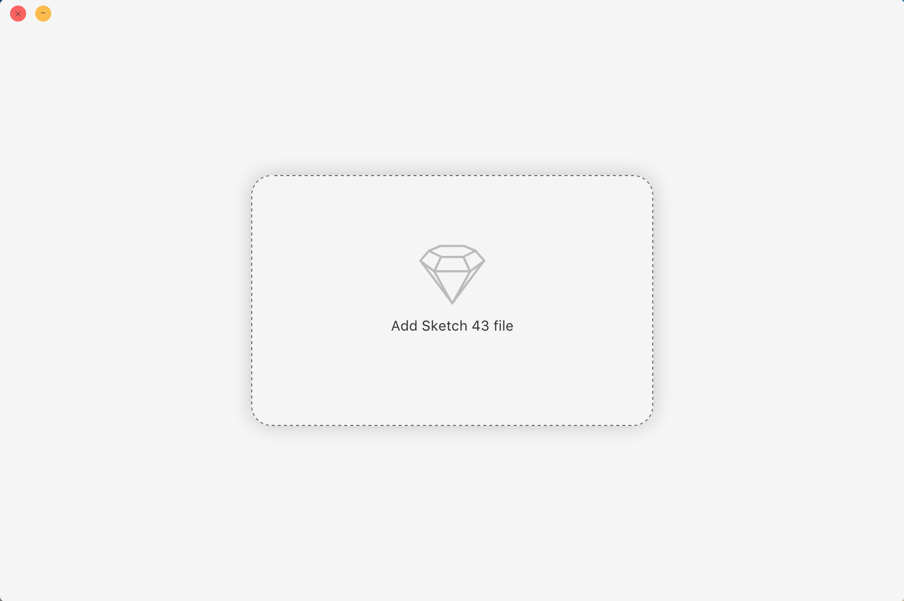
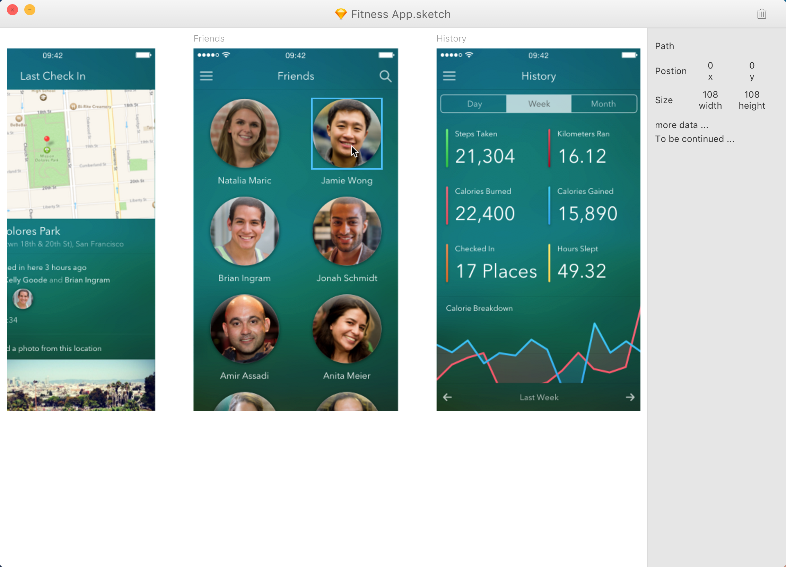

## Introduction

Sketch Viewer is a cross platform view sketch file, support for web, Windows and MAC, It can inspect of information layer.

## Downloads

[windows](package/for_win.zip)  [mac](package/for_mac.zip)

## Screenshots

### How to run source code?

`Sketch Viewer` is built with [electron](https://electron.atom.io/), and Vue.js

1. Clone project to the local;

2. `npm i -g electron electron-packager`

3. install dependencies: `npm i`

4. first run `npm run build`, then `npm run dev-electron`

### How to build source code

`npm run build-mac` and `npm run build-windows`
